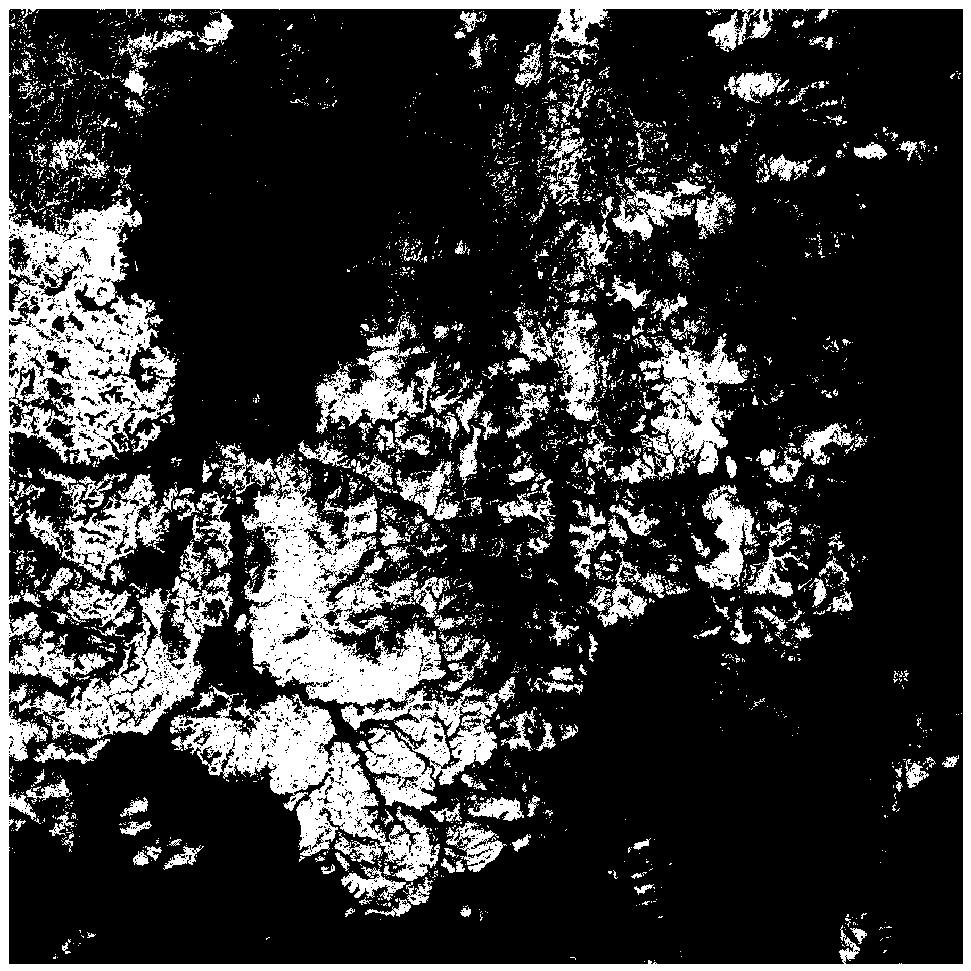
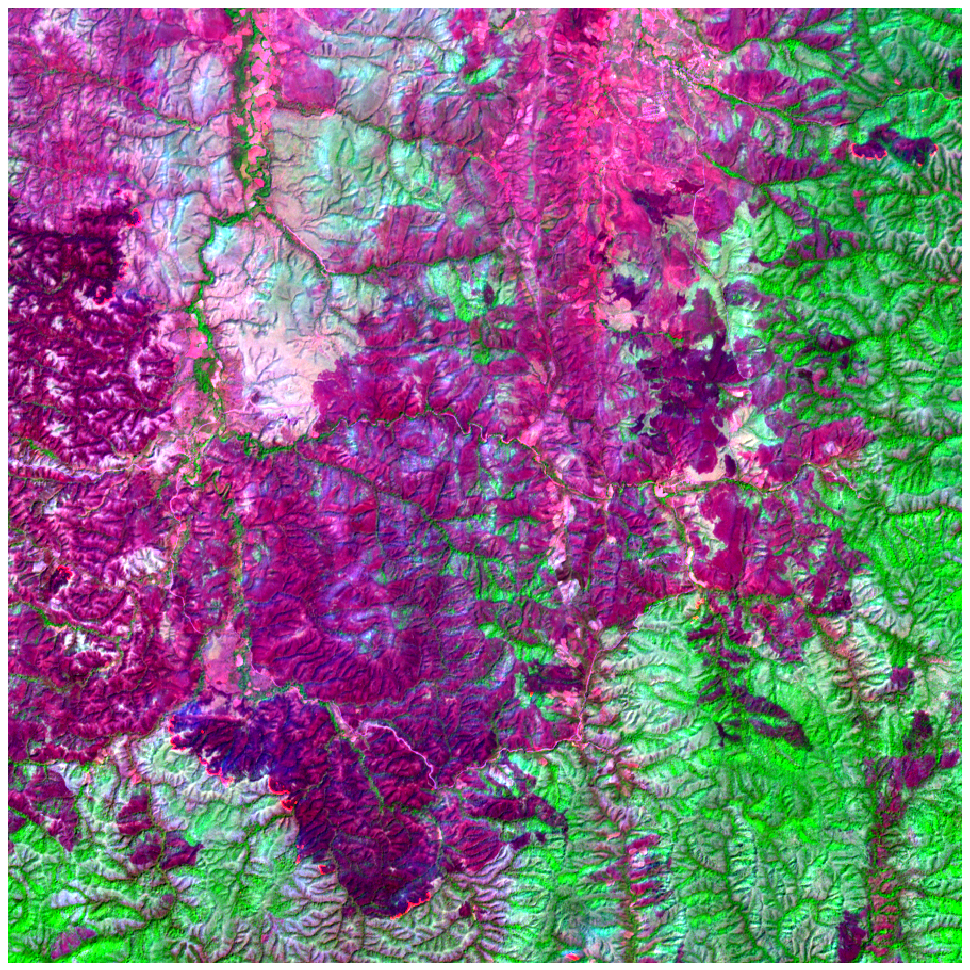

# GISTDA-Wildfire-Extraction

## Repository for method to perform Wildfire Extract from Sentinel-2 Satellite images which this method developed by Thailand Royal Forest Department.

## Prerequisites
### Anaconda
You need to download Anaconda at https://www.anaconda.com/download and install. And then you would need to create environment from environment.yml file on your computer.

### Anaconda Environment Prepare
environment.yml file contain list all the packages and dependencies in the environment, which is need to use for run Sentinel-2 Image Processing Pipeline for Burn Area Detection.
Environment name: RIDA_env which is name you need to activate environment on your computer.

Environment Prepare step:
- Open Anaconda Terminal on your computer after you installed.
- use following command: ```conda env create -f /path/to/folder/environment.yml```
Example: ```conda env create -f "D:\Sentinel-2 Environment\environment.yml"```

## Python Modules
### Sentinel-2 Image Before and After Burn Resampling and Multi-Band Processing Script
This Python script processes Sentinel-2 imagery by resampling multiple spectral bands to a 10m resolution and then combining them into a single multi-band GeoTIFF file. The script leverages rasterio and GDAL for handling raster files, and it automates the process of finding and processing all relevant .jp2 files in a given folder structure.

```sentinel-2_Pre-Image.py``` is Module to perform Resampling and Multi-Band Processing for Before Burn Images.

```sentinel-2_Post-Image.py``` is Module to perform Resampling and Multi-Band Processing for After Burn Images.

Key Features:
- Resampling: The script reads each band image (e.g., B03, B04, B05) and resamples it to a 10m resolution using bilinear interpolation.
- Multi-Band Merging: After resampling, the script combines specified bands (B01, B02, B03, B04, B05, B06, B07, B08, B8A, B09, B11, B12) into a single GeoTIFF file.
- Automated Folder Search: It recursively searches for folders containing Sentinel-2 .jp2 files and processes all relevant imagery automatically.
- Temporary Files Cleanup: Resampled files are stored temporarily and removed after processing to minimize storage usage.
- Output Naming: The output file is named based original Sentinel-2 images, ensuring clear organization of the results.

### Identify Burned Areas using Spectral Indices.

This Python script processes Sentinel-2 satellite imagery to identify burned areas using spectral indices. The code is designed to handle pre- and post-fire images in chunks, enabling efficient memory usage and allowing for parallel processing to increase speed.

- Spectral Index Calculation: Computes differenced normalized burn ratio (dNBR), normalized difference vegetation index (NDVI), and normalized difference water index (NDWI) to analyze fire impact.

- Burn Label Creation: Generates a binary mask to identify potential burned areas based on threshold criteria applied to the calculated indices. 

- Spectral Index Threshold criteria for masking as Burn: ```dNBR > 0.27 & NDWI < 0 & NDVI < 0.14 & Band8(NIR) < 2500```

### Directory Structure
The script expects the following folder structure:

```python

GISTDA_BURN EXTRACT
     |_Post-Image
     |_Pre-Image
     |_Raster
        |_input
        |_output
```

Post-Image/: Directory store Sentinel-2 Image which is After Burn Period as same tile with Pre-Image Folder.
Pre-Image/: Directory store Sentinel-2 Image which is Before Burn Period as same tile with Post-Image Folder.
input/: Contains pre- and post-fire images in TIFF format (```pre``` and ```post``` in filenames).
output/: Stores the processed output for each image tile and chunk.

### Features
- Chunked Processing: Handles large images in smaller chunks, reducing memory usage.
- Spectral Index Calculation: Computes differenced normalized burn ratio (dNBR), normalized difference vegetation index (NDVI), and normalized difference water index (NDWI) to analyze fire impact.
- Burn Label Creation: Generates a binary mask to identify potential burned areas based on threshold criteria applied to the calculated indices.
- Parallel Processing: Supports multi-process execution to speed up processing across multiple images.
Error Handling: Logs any errors during execution to help with debugging and monitoring.

### Wildfire Extract Sample


From Above image, display area masking as burn will be show as white color when open file with QGIS. And below when compare with Band combination following B12, B8A, B4 or Short-Wave Infrared:



Which burn area will be display as strong purple color and active file display as orange. For pink color that display as Landuse or bare soil and built-up areas. Vegetation in various shades of green.

## Collaboration

