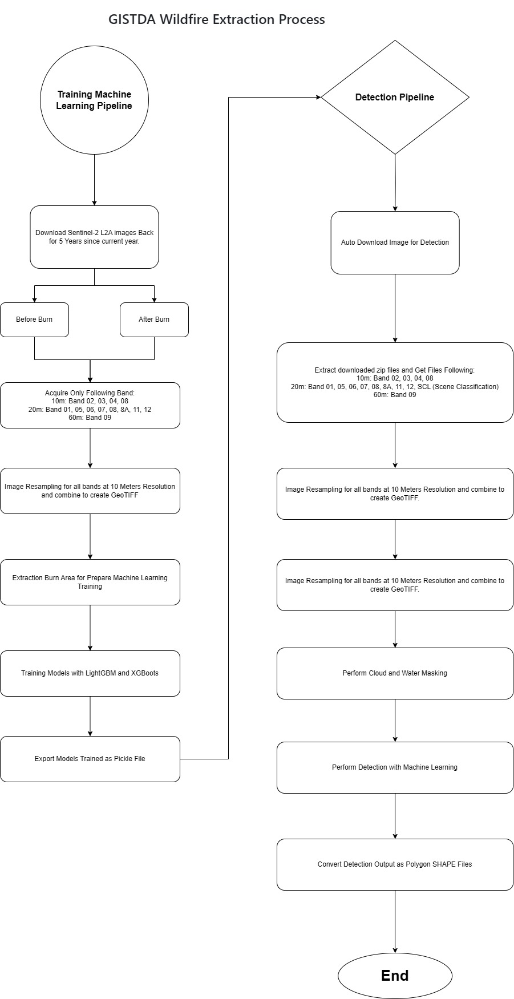
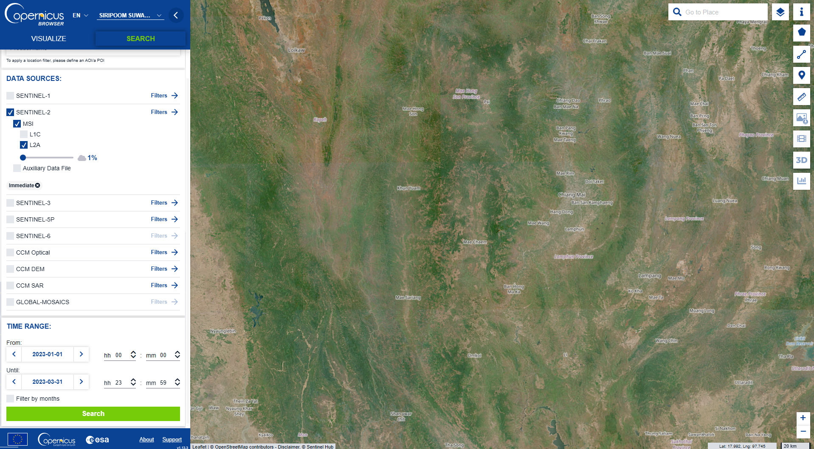
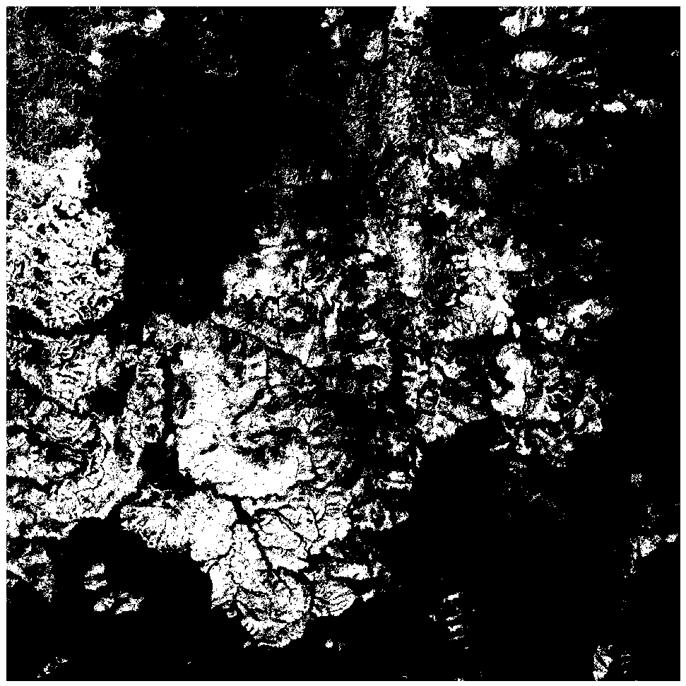
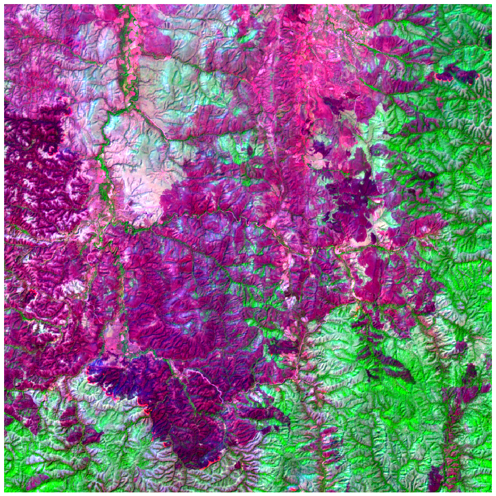

# GISTDA-Wildfire-Extraction

### Repository for method to perform Wildfire Extract from Sentinel-2 Satellite images which this method developed by Thailand Royal Forest Department.

## Prerequisites
### Anaconda
You need to download Anaconda at https://www.anaconda.com/download and install. And then you would need to create environment from environment.yml file on your computer.

### Anaconda Environment Prepare
environment.yml file contain list all the packages and dependencies in the environment, which is need to use for run Sentinel-2 Image Processing Pipeline for Burn Area Detection.
Environment name: RIDA_env which is name you need to activate environment on your computer.

Environment Prepare step:
- Open Anaconda Terminal on your computer after you installed.
- use following command: ```conda env create -f /path/to/folder/environment.yml```
Example: ```conda env create -f "D:\Sentinel-2 Environment\environment.yml"```

## Workflow of Program


### Sentinel-2 Imagery
You would need to download Sentinel-2 Image from ```https://browser.dataspace.copernicus.eu/``` And then next step:
- Search area that you interest including before and after burn period. Which both of period need to be same tile.
- Before burn image period suggest during in November - December.
- After burn image period suggest during in January - April.
- You need to set parameter during download as below:



        - Satellite: Sentinel-2
        - Processing Level: Level-2A
        - Cloud: 1%
        - Time Range you can set as above sugguestion.     

- After downloaded done, need to extract zip file from download which contain Sentinel-2 image. Which directory structure example as below:

```python

├── S2A_MSIL2A_20201223T040201_N0500_R004_T47QLA_20230227T185228.SAFE
   ├── S2A_MSIL2A_20201223T040201_N0500_R004_T47QLA_20230227T185228.SAFE
      ├── GRANULE
         ├── L2A_T47QLA_A028744_20201223T041215
            ├── IMG_DATA
               ├── R10m
                  ├── T47QLA_20201223T040201_B02_10m.jp2
                  ├── T47QLA_20201223T040201_B03_10m.jp2
                  ├── T47QLA_20201223T040201_B04_10m.jp2
                  ├── T47QLA_20201223T040201_B08_10m.jp2
                ├── R20m
                  ├── T47QLA_20201223T040201_B01_20m.jp2
                  ├── T47QLA_20201223T040201_B05_20m.jp2
                  ├── T47QLA_20201223T040201_B06_20m.jp2
                  ├── T47QLA_20201223T040201_B07_20m.jp2
                  ├── T47QLA_20201223T040201_B8A_20m.jp2
                  ├── T47QLA_20201223T040201_B11_20m.jp2
                  ├── T47QLA_20201223T040201_B12_20m.jp2
                  ├── T47QLA_20201223T040201_SCL_20m.jp2
                ├── R60m
                  ├── T47QLA_20201223T040201_B09_60m.jp2
```
## Python Modules
### Sentinel-2 Image Before and After Burn Resampling and Multi-Band Processing Script
This Python script processes Sentinel-2 imagery by resampling multiple spectral bands to a 10m resolution and then combining them into a single multi-band GeoTIFF file. The script leverages rasterio and GDAL for handling raster files, and it automates the process of finding and processing all relevant .jp2 files in a given folder structure.

```sentinel-2_Pre-Image.py``` is Module to perform Resampling and Multi-Band Processing for Before Burn Images.

```sentinel-2_Post-Image.py``` is Module to perform Resampling and Multi-Band Processing for After Burn Images.

Key Features:
- Resampling: The script reads each band image (e.g., B03, B04, B05) and resamples it to a 10m resolution using Nearest-neighbor interpolation.
- Multi-Band Merging: After resampling, the script combines specified bands (B01, B02, B03, B04, B05, B06, B07, B08, B8A, B09, B11, B12) into a single GeoTIFF file.
- Automated Folder Search: It recursively searches for folders containing Sentinel-2 .jp2 files and processes all relevant imagery automatically.
- Temporary Files Cleanup: Resampled files are stored temporarily and removed after processing to minimize storage usage.
- Output Naming: The output file is named based original Sentinel-2 images, ensuring clear organization of the results.

### Identify Burned Areas using Spectral Indices.

This Python script processes Sentinel-2 satellite imagery to identify burned areas using spectral indices. The code is designed to handle pre- and post-fire images in chunks, enabling efficient memory usage and allowing for parallel processing to increase speed.

- Spectral Index Calculation: Computes differenced normalized burn ratio (dNBR), normalized difference vegetation index (NDVI), and normalized difference water index (NDWI) to analyze fire impact.

- Burn Label Creation: Generates a binary mask to identify potential burned areas based on threshold criteria applied to the calculated indices. 

- Spectral Index Threshold criteria for masking as Burn: ```dNBR > 0.27 & NDWI < 0 & NDVI < 0.14 & Band8(NIR) < 2500```

### Directory Structure
The script expects the following folder structure:

```python

GISTDA_BURN EXTRACT
     |_Classified_Image
     |_Classified_Output
     |_Post_Image
     |_Pre_Image
     |_Raster
        |_input
        |_output
     |_Raster Classified
     |_Raster Classified Cloud Mask
     |_SCL Classified
     |_Wildfire Polygon
```
- Classified_Image/: Directory to store Sentinel-2 Imageries for before begins Forest Fire Detection.
- Classified_Output/: Directory to store Detection Result from Machine Learning as Raster GeoTIFF.
- Post_Image/: Directory store Sentinel-2 Image which is After Burn Period as same tile with Pre-Image Folder.
- Pre_Image/: Directory store Sentinel-2 Image which is Before Burn Period as same tile with Post-Image Folder.
- input/: Contains pre- and post-fire images in TIFF format (```pre``` and ```post``` in filenames).
- output/: Stores the processed output for each image tile and chunk.
- Raster Classified/: Directory to store Raster GeoTIFF for perform Forest Fire Detection that have been performed image resampling.
- Raster Classified Cloud Mask/: Directory Store Raster GeoTIFF that have been making cloud, cloud shadow and water masking.
- SCL Classified/: This directory store Scene Classification (SCL) as tif file which converted from jp2 in each imagery that you acquire and store in Classified Image Directory. 
- Wildfire Polygon/: Directory to store Burn Detection Polygon Area as SHAPE file format.

### Features
- Chunked Processing: Handles large images in smaller chunks, reducing memory usage.
- Spectral Index Calculation: Computes differenced normalized burn ratio (dNBR), normalized difference vegetation index (NDVI), and normalized difference water index (NDWI) to analyze fire impact.
- Burn Label Creation: Generates a binary mask to identify potential burned areas based on threshold criteria applied to the calculated indices.
- Parallel Processing: Supports multi-process execution to speed up processing across multiple images.
Error Handling: Logs any errors during execution to help with debugging and monitoring.

### Wildfire Extract Sample


From Above image, display area masking as burn will be show as white color when open file with QGIS. And below when compare with Band combination following B12, B8A, B4 or Short-Wave Infrared:



Which burn area will be display as strong purple color and active file display as orange. For pink color that display as Landuse or bare soil and built-up areas. Vegetation in various shades of green.

## Wildfire Detection
After finished Burn Extractions, and you would need to use Machine Learning have been trained to detection for new imagery. This pipeline will perform detection for new imagery that Machine Learning have not been see before.

### Detection Directory

```python

├── S2A_MSIL2A_20201223T040201_N0500_R004_T47QLA_20230227T185228.SAFE
   ├── S2A_MSIL2A_20201223T040201_N0500_R004_T47QLA_20230227T185228.SAFE
      ├── GRANULE
         ├── L2A_T47QLA_A028744_20201223T041215
            ├── IMG_DATA
               ├── R10m
                  ├── T47QLA_20201223T040201_B02_10m.jp2
                  ├── T47QLA_20201223T040201_B03_10m.jp2
                  ├── T47QLA_20201223T040201_B04_10m.jp2
                  ├── T47QLA_20201223T040201_B08_10m.jp2
                ├── R20m
                  ├── T47QLA_20201223T040201_B01_20m.jp2
                  ├── T47QLA_20201223T040201_B05_20m.jp2
                  ├── T47QLA_20201223T040201_B06_20m.jp2
                  ├── T47QLA_20201223T040201_B07_20m.jp2
                  ├── T47QLA_20201223T040201_B8A_20m.jp2
                  ├── T47QLA_20201223T040201_B11_20m.jp2
                  ├── T47QLA_20201223T040201_B12_20m.jp2
                  ├── T47QLA_20201223T040201_SCL_20m.jp2
                ├── R60m
                  ├── T47QLA_20201223T040201_B09_60m.jp2
```
### Classified Cloud Mask
The ```classified_cloud_mask.py``` script processes Sentinel-2 satellite imagery to apply cloud masks and save the results as compressed GeoTIFF files. It reads the Sentinel-2 Scene Classification Layer (SCL) and band data, applies cloud masks, and saves the masked images.

#### Key Features:
- Reading SCL and Band Data: The script reads Sentinel-2 Scene Classification Layer (SCL) and band data.
- Cloud Masking: Applies cloud masks to the band data based on the SCL.
- Logging: Provides detailed logging for each step of the process.
- Error Handling: Catches and logs errors during processing.
- Output: Saves the masked images as compressed GeoTIFF files.

### Wildfire Classification
The ```wildfire_classified.py``` script processes Sentinel-2 satellite imagery to classify burned areas using machine learning. The script reads raster data, cleans it, calculates fire indices, and applies a pre-trained model to classify burned areas. The results are saved as GeoTIFF files.

#### Key Features:
- Reading Raster Data: The script reads Sentinel-2 imagery, handling no data and NaN values robustly.
- Data Cleaning: It applies a valid pixel mask and handles NaN/infinite values to clean the data.
- Fire Indices Calculation: Computes normalized difference vegetation index (NDVI) and normalized difference water index (NDWI) to analyze fire impact.
- Machine Learning Classification: Uses a pre-trained model to classify burned areas based on the calculated indices.
- Chunked Processing: Handles large images in smaller chunks, reducing memory usage.
- Output: Saves the classification results as GeoTIFF files with binary output indicating burned areas.

### Wildfire Polygon Extraction
The ```wildfire_polygon.py``` script processes classified GeoTIFF files to generate polygon shapefiles representing burnt areas. The script searches for all TIFF files in a specified root folder and its subfolders, creates an output folder for each file, and generates polygons where the pixel value is 1 (indicating burnt areas) in the GeoTIFF. The polygons are saved as shapefiles in the output folder. The Script will be perform for Burn Polygon and Administrative Boundaries SHAPE Files Following Thailand, Laos, Myanmar, and Vietnam.

Key Features:
- Recursive Search: Finds all TIFF files in the root folder and its subfolders.
- Output Folder Creation: Creates a folder for each TIFF file inside the specified output base folder.
- Polygon Shapefile Generation: Generates polygons for burnt areas and saves them as shapefiles.
- Metadata Extraction: Extracts fire date from the TIFF file name and adds it to the shapefile attributes.
- Geospatial Data Handling: Converts CRS to Latitude and Longitude, calculates centroids, and computes the area of each polygon.

## Collaboration


Thank you for Administrative Boundaries Data from Thailand, Laos, Myanmar, and Vietnam.
Thailand Administrative Boundaries : GISTDA
Laos Administrative Boundaries : [The Humanitarian Data Exchange](https://data.humdata.org/dataset/cod-ab-lao)
Myanmar Administrative Boundaries : [The Humanitarian Data Exchange](https://data.humdata.org/dataset/cod-ab-mmr)
Vietnam Administrative Boundaries : [The Humanitarian Data Exchange](https://data.humdata.org/dataset/cod-ab-vnm)